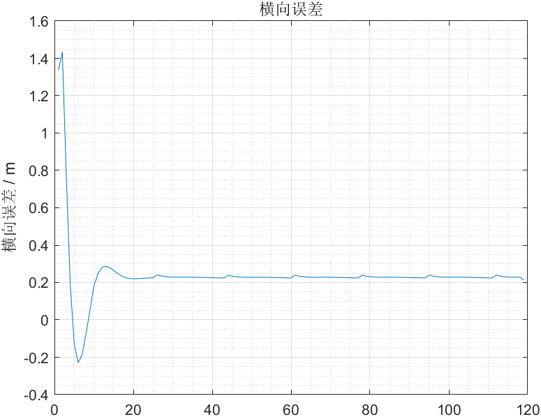
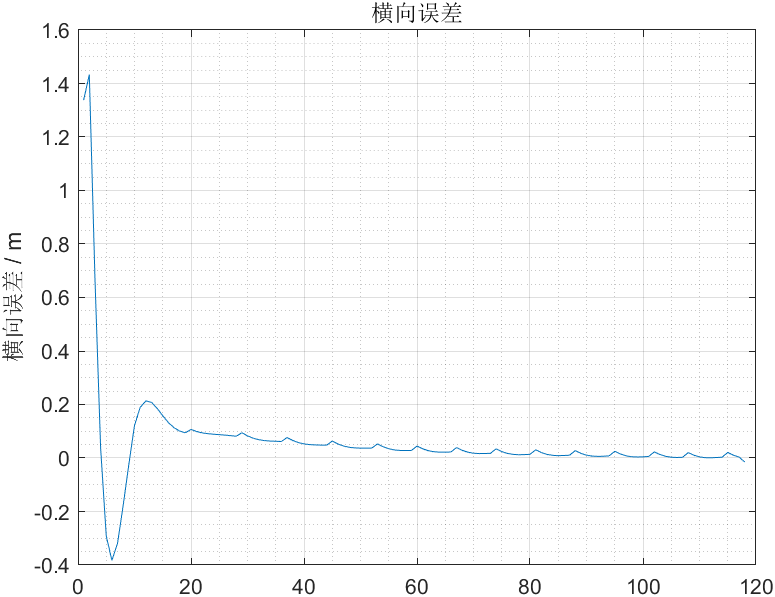

# 基于Matlab实现纯跟踪(Pure Pursuit)算法

在参考资料1的基础上修正部分错误，优化代码，演示纯跟踪算法。

  

## 纯跟踪算法本质

参考人类驾驶员的行为，以车的后轴为基点，通过控制前轮的偏角delta，使车辆沿一条经过预瞄点的**圆弧**行驶，跟踪效果将由ld决定，如何设计ld也是算法的改进方向之一。  
预瞄点的引入使得控制更加平顺，普通PID控制跟踪的是离车辆最近的轨迹点，而纯跟踪法跟踪的是预瞄点。  
纯跟踪本质是一个**P控制器**，对车辆进行**横向控制**，代码示例中的横向误差如图所示：  
  
可见横向误差不收敛于0，即横向控制存在静态误差，加入积分控制后，横向误差如图所示：  
  
(加入积分控制，静态误差减小，超调量增大，为减小超调量，可引入微分控制)

## 参考

1. [B站小黎]<https://www.bilibili.com/video/BV1Ly4y177dF/?spm_id_from=333.999.0.0&vd_source=be5bd51fafff7d21180e251563899e5e>
